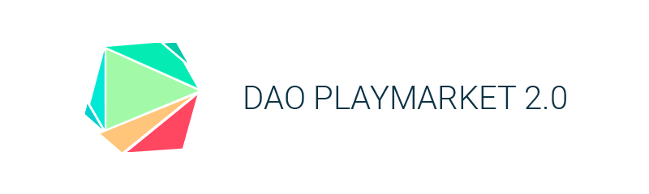
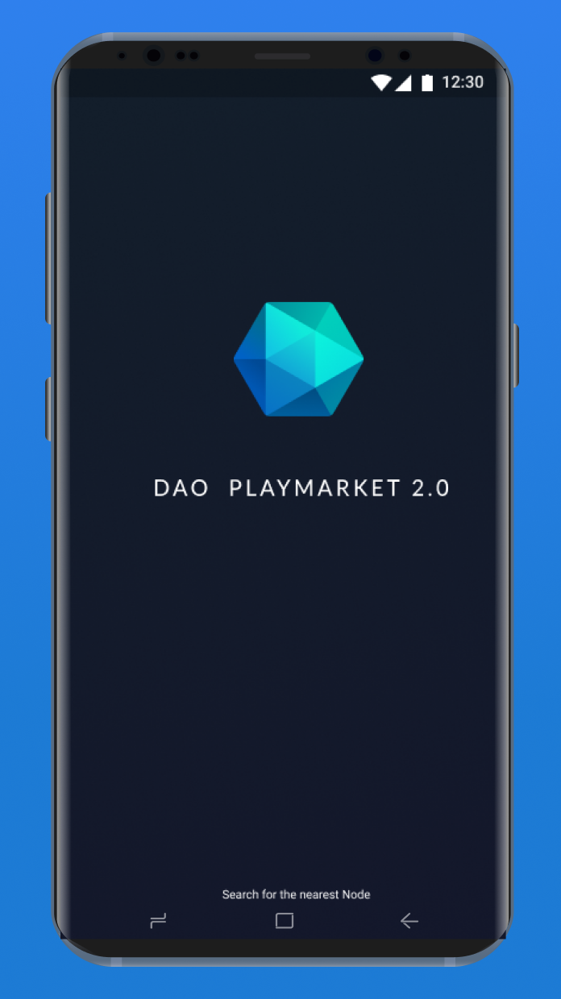
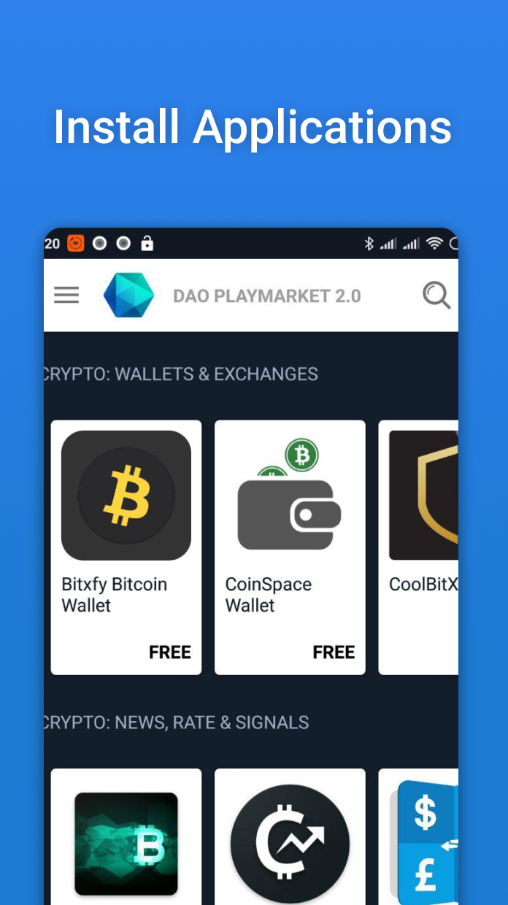
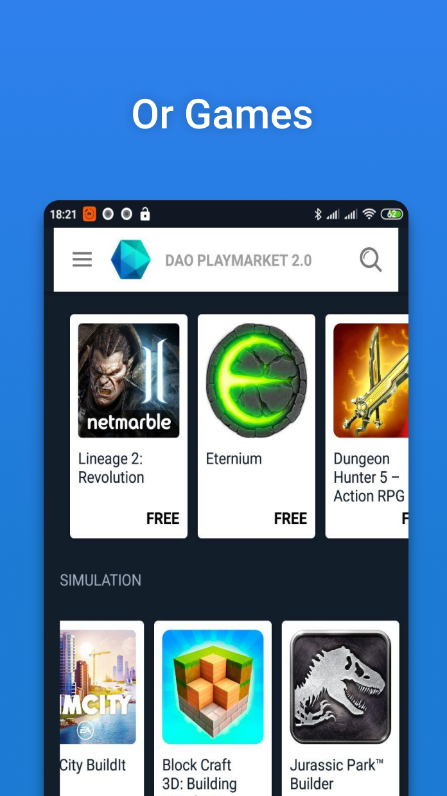
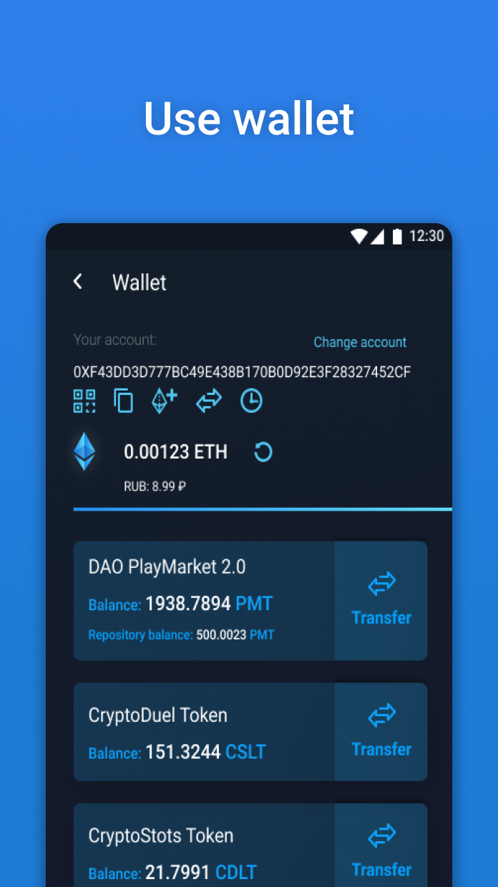
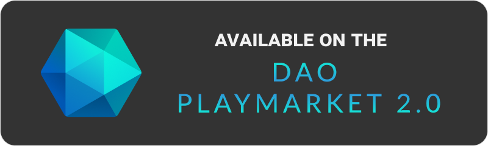

# DAO PlayMarket 2.0 Android Application

DAO PlayMarket 2.0 is a decentralized Android App Store that accepts payments in cryptocurrency and is combined with an STO platform for developers.

On the platform, you can:

1. Invest in developing the app you like and earn a dividend income from it.
2. Enjoy additional benefits, for example, tokens of an app for its purchase or for taking actions within the app.
3. Get secure and smooth access to a decentralized, censorship-resistant platform, both at the national level and at the level of specific mobile app stores.
4. Pay for purchases for cryptocurrency.
5. Thus, the user gets the opportunity to be not just a consumer, but also to participate actively in the platform, to promote its development and to derive financial benefits from this.

Developers can:

1. Issue tokens of their app and distribute them among current shareholders.
2. DAO PlayMarket 2.0 will provide developers with simple and effective tools to promote their app, including user-friendly feedback between the developer and users.
3. The platform commission is 1% (Google Play has about 30%). This commission is collected by the node as a reward for financial transactions.
4. Income from sales of an app and its content will be paid to a developer for a strictly fixed period under a concluded smart contract. Due to the features of the blockchain technology, when a user purchases an app, the income is instantly distributed among the owners of app's tokens.
5. Source codes for all internal smart contracts of PlayMarket 2.0, the mobile app DAO PlayMarket 2.0 and the playmarket.io website will be available. Moreover, all the platform documentation will be publicly available.
6. The ability to sell their apps for cryptocurrency
7. No bureaucracy.

  |   |  | 

The application supports Android 5.0 and above.

## How it works

The mobile app is developed on the basis of the modern technologies recommended by Android Developers (the so-called native technologies). 

The app is equipped with a cold wallet created directly on the mobile device. The app supports encrypted backup and restore of wallets, secure key storage and offline signing of transactions. This means that your keys are kept on the device and never sent anywhere to make a purchase. 

The app supports the Markdown markup language which provides simple and standard formatting of app descriptions, thereby allowing developers to create beautiful designs for placing apps on the platform. The mobile app has a mechanism for detecting the nearest trusted connection node. Now the app uses DNS, but in the future it will be connected directly to the blockchain to find the nearest node.

All communications between the app and the node are encrypted using the TLS protocol. 

After installation, the app suggests generating a new wallet or importing an existing one. A wallet can be replenished directly or through a cryptocurrency exchange. 

The mobile app connects to the nearest node and receives from it all the necessary information about apps, their price, etc., as well as displays all the data on the screen. 

When you purchase an app, PlayMarket 2.0 generates a transaction, which is transferred to the node. The task of the node is to check the transaction, the balance and, if all conditions are met, to issue the purchased app by sending a transaction to the blockchain. After the mobile app is downloaded, smart contracts indicate the purchase data: name of the app and the node through which the transaction has been made. This is necessary for the subsequent distribution of profits.

#### Smart contracts
[Smart contracts](https://github.com/CryptonStudio/PlayMarket-2.0-Contracts)

#### Disclaimer
By using DAO PlayMarket 2.0 code fully or partially, API, Nodes, Mobile Application, Smart Contracts or any other service on your website or app for commerce or non-profit activities, you hereby grant permission and allow us to use your business name and/or trademark in our marketing or advertising.
